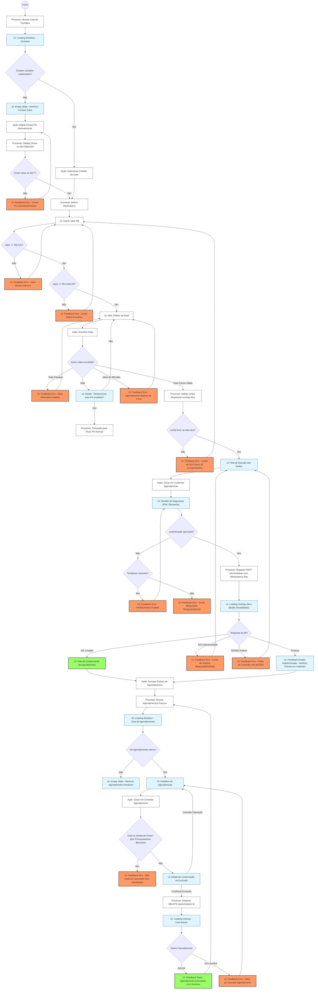

```mermaid
graph TD
    %% Definições de Estilos Visuais Semânticos
    classDef error fill:#f96,stroke:#333,stroke-width:2px;
    classDef success fill:#9f6,stroke:#333,stroke-width:2px;
    classDef uiState fill:#e1f5fe,stroke:#01579b,stroke-width:1px;
    classDef process fill:#fff,stroke:#333,stroke-width:1px;

    %% Início e Seleção de Contato
    Start((Início)) --> LoadContacts["Processo: Buscar Lista de Contatos"]:::process
    LoadContacts --> LoadingContacts["UI: Loading Skeleton - Contatos"]:::uiState
    LoadingContacts --> CheckContacts{"Existem contatos cadastrados?"}

    CheckContacts -- Não --> EmptyContacts["UI: Empty State - Nenhum Contato Salvo"]:::uiState
    EmptyContacts --> InputKeyManual["Ação: Digitar Chave Pix Manualmente"]:::process

    CheckContacts -- Sim --> SelectContactList["Ação: Selecionar Contato da Lista"]:::process

    InputKeyManual --> ValidateDICT["Processo: Validar Chave no DICT/BACEN"]:::process
    ValidateDICT --> CheckDICT{"Chave ativa no DICT?"}
    CheckDICT -- Não --> ErrorDICT["UI: Feedback Erro - Chave Pix Inexistente/Inativa"]:::error
    ErrorDICT --> InputKeyManual

    CheckDICT -- Sim --> SetRecipient["Processo: Definir Destinatário"]:::process
    SelectContactList --> SetRecipient

    %% Entrada e Validação de Valor
    SetRecipient --> InputAmount["UI: Inserir Valor R$"]:::process
    InputAmount --> CheckAmountValid{"Valor >= R$ 0,01?"}
    CheckAmountValid -- Não --> ErrorZeroAmount["UI: Feedback Erro - Valor Mínimo R$ 0,01"]:::error
    ErrorZeroAmount --> InputAmount

    CheckAmountValid -- Sim --> CheckLimit{"Valor <= R$ 5.000,00?"}
    CheckLimit -- Não --> ErrorMaxLimit["UI: Feedback Erro - Limite Diário Excedido"]:::error
    ErrorMaxLimit --> InputAmount

    %% Seleção e Validação de Data
    CheckLimit -- Sim --> OpenDatePicker["UI: Abrir Seletor de Data"]:::process
    OpenDatePicker --> SelectDate["Ação: Escolher Data"]:::process
    SelectDate --> CheckDateType{"Qual a data escolhida?"}

    CheckDateType -- "Data Passada" --> ErrorPastDate["UI: Feedback Erro - Data Retroativa Inválida"]:::error
    ErrorPastDate --> OpenDatePicker

    CheckDateType -- "Hoje" --> PromptToday["UI: Modal - Redirecionar para Pix Imediato?"]:::uiState
    PromptToday -- Não --> OpenDatePicker
    PromptToday -- Sim --> RedirectImmediate["Processo: Transição para Fluxo Pix Normal"]:::process

    CheckDateType -- "Além de 365 dias" --> ErrorMaxFuture["UI: Feedback Erro - Agendamento Máximo de 1 Ano"]:::error
    ErrorMaxFuture --> OpenDatePicker

    CheckDateType -- "Data Futura Válida" --> ValidateAccumulatedLimit["Processo: Validar Limite Disponível na Data Alvo"]:::process
    ValidateAccumulatedLimit --> CheckTargetDayLimit{"Limite livre na data alvo?"}
    CheckTargetDayLimit -- Não --> ErrorTargetLimit["UI: Feedback Erro - Limite do Dia Futuro Já Comprometido"]:::error
    ErrorTargetLimit --> InputAmount

    %% Revisão e Autenticação
    CheckTargetDayLimit -- Sim --> ReviewScreen["UI: Tela de Revisão dos Dados"]:::uiState
    ReviewScreen --> ConfirmAction["Ação: Clicar em Confirmar Agendamento"]:::process
    ConfirmAction --> ChallengeMFA["UI: Desafio de Segurança (PIN / Biometria)"]:::uiState

    ChallengeMFA --> CheckAuth{"Autenticação aprovada?"}
    CheckAuth -- Não --> CheckRetries{"Tentativas restantes?"}
    CheckRetries -- Sim --> ErrorAuthRetry["UI: Feedback Erro - PIN/Biometria Inválida"]:::error
    ErrorAuthRetry --> ChallengeMFA
    CheckRetries -- Não --> ErrorAuthBlocked["UI: Feedback Erro - Conta Bloqueada Temporariamente"]:::error

    %% Disparo da API de Agendamento com Trava de Duplo Clique
    CheckAuth -- Sim --> SubmitAPI["Processo: Disparar POST /pix/schedule com Idempotency-Key"]:::process
    SubmitAPI --> LoadingOverlay["UI: Loading Overlay Ativo (Botão Desabilitado)"]:::uiState

    LoadingOverlay --> APIResponse{"Resposta da API"}
    APIResponse -- "201 Created" --> SuccessReceipt["UI: Tela de Comprovante de Agendamento"]:::success
    APIResponse -- "422 Unprocessable" --> ErrorBusinessAPI["UI: Feedback Erro - Conta de Destino Bloqueada/Inválida"]:::error
    ErrorBusinessAPI --> ReviewScreen
    APIResponse -- "500/503 Failure" --> ErrorServer["UI: Feedback Erro - Falha de Conexão com BACEN"]:::error
    ErrorServer --> ReviewScreen
    APIResponse -- "Timeout" --> StateTimeout["UI: Feedback Estado Indeterminado - Verificar Extrato em Instantes"]:::uiState

    %% Gestão e Cancelamento de Agendamento
    SuccessReceipt --> NavToSchedules["Ação: Acessar Extrato de Agendamentos"]:::process
    StateTimeout --> NavToSchedules
    NavToSchedules --> LoadSchedules["Processo: Buscar Agendamentos Futuros"]:::process
    LoadSchedules --> LoadingList["UI: Loading Skeleton - Lista de Agendamentos"]:::uiState
    LoadingList --> CheckScheduleList{"Há agendamentos ativos?"}

    CheckScheduleList -- Não --> EmptyScheduleList["UI: Empty State - Nenhum Agendamento Pendente"]:::uiState
    CheckScheduleList -- Sim --> ViewScheduleDetail["UI: Detalhes do Agendamento"]:::uiState

    ViewScheduleDetail --> CancelAction["Ação: Clicar em Cancelar Agendamento"]:::process
    CancelAction --> CheckCutOff{"Está na Janela de Corte? (Em Processamento Bancário)"}
    CheckCutOff -- Sim --> ErrorCutOffLocked["UI: Feedback Erro - Não pode ser cancelado (Em Liquidação)"]:::error

    CheckCutOff -- Não --> PromptCancelConfirm["UI: Modal de Confirmação de Exclusão"]:::uiState
    PromptCancelConfirm -- Cancelar Operação --> ViewScheduleDetail
    PromptCancelConfirm -- Confirmar Exclusão --> CallAPICancel["Processo: Disparar DELETE /pix/schedule/:id"]:::process

    CallAPICancel --> LoadingCancel["UI: Loading Overlay - Cancelando"]:::uiState
    LoadingCancel --> CancelAPIResponse{"Status Cancelamento"}

    CancelAPIResponse -- "200 OK" --> SuccessCancelToast["UI: Feedback Toast - Agendamento Cancelado com Sucesso"]:::success
    SuccessCancelToast --> LoadSchedules
    CancelAPIResponse -- "Erro 4xx/5xx" --> ErrorCancelFail["UI: Feedback Erro - Falha ao Cancelar Agendamento"]:::error
    ErrorCancelFail --> ViewScheduleDetail
```
